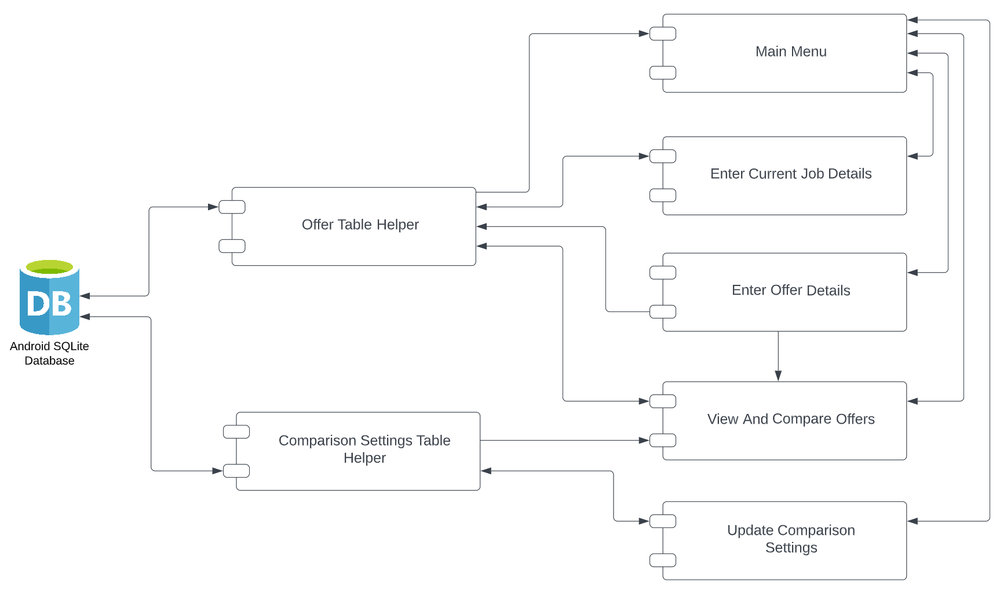
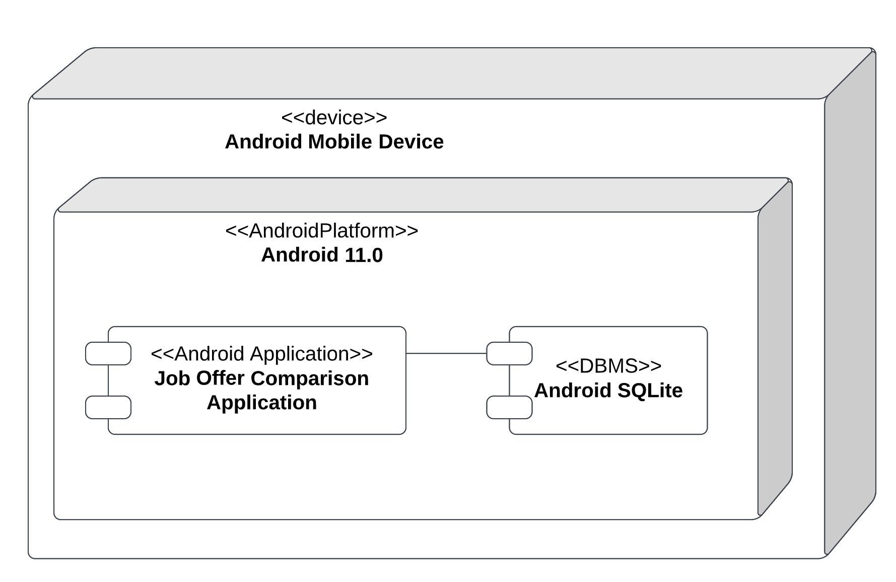
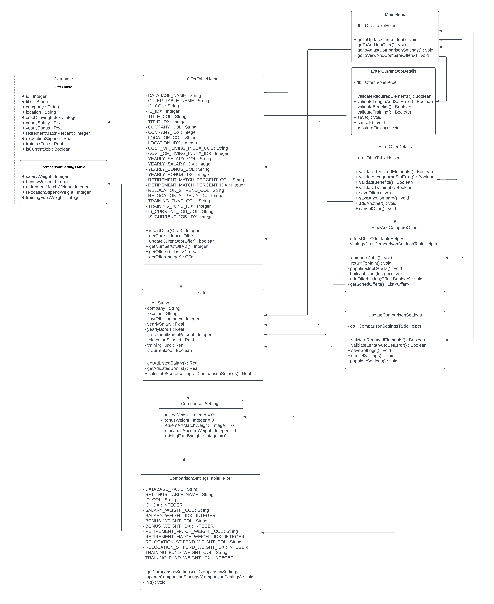
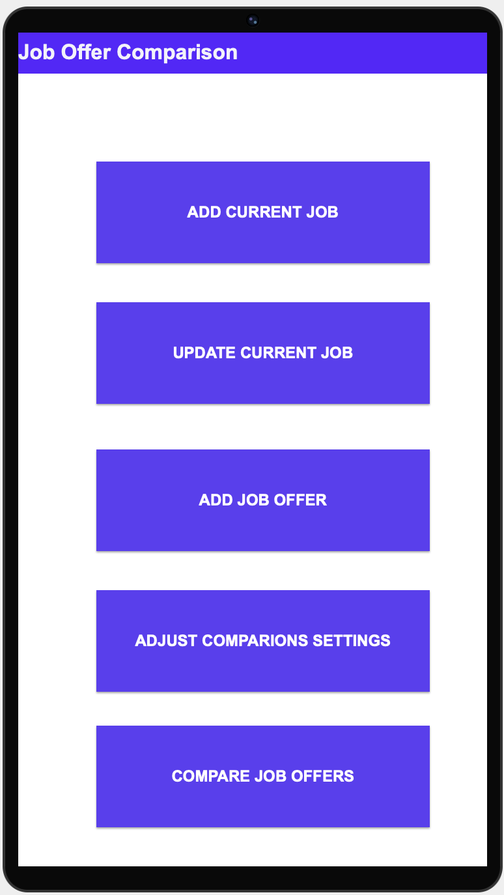
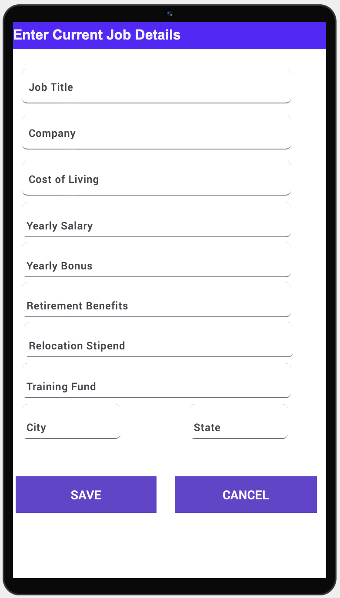
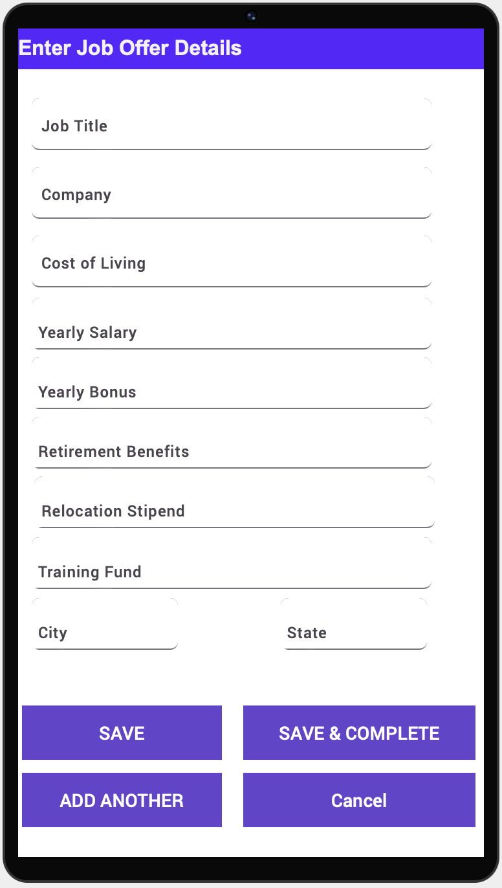
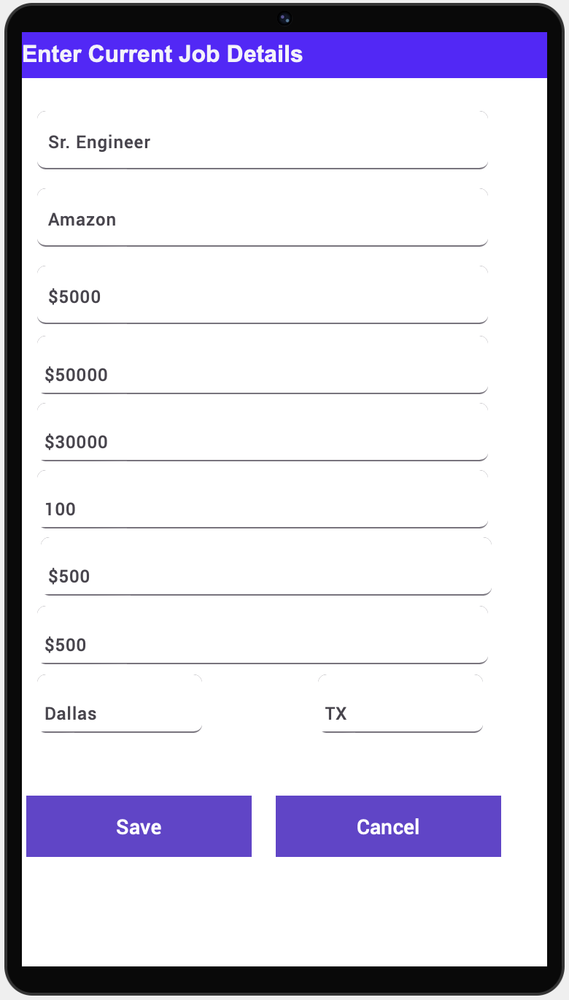
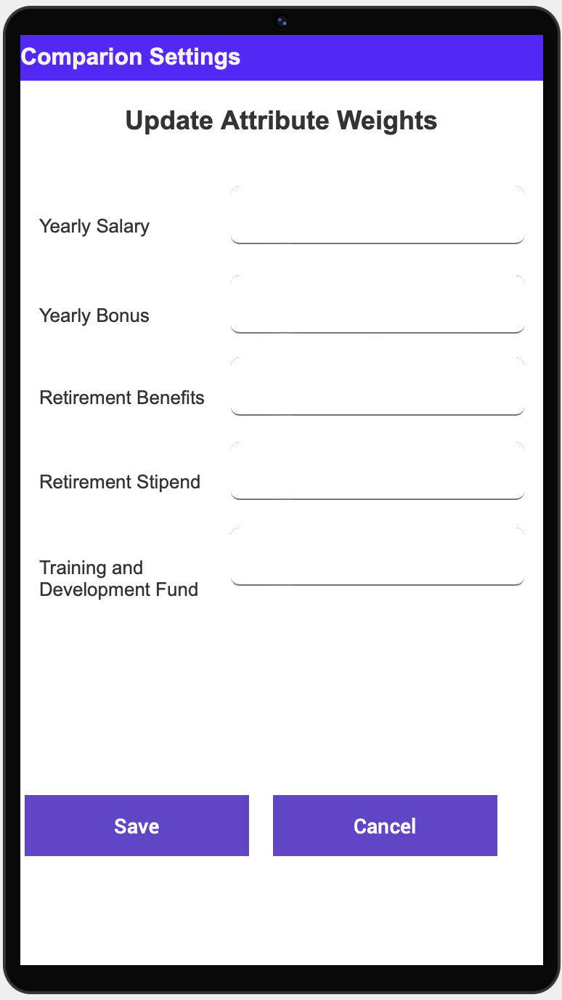
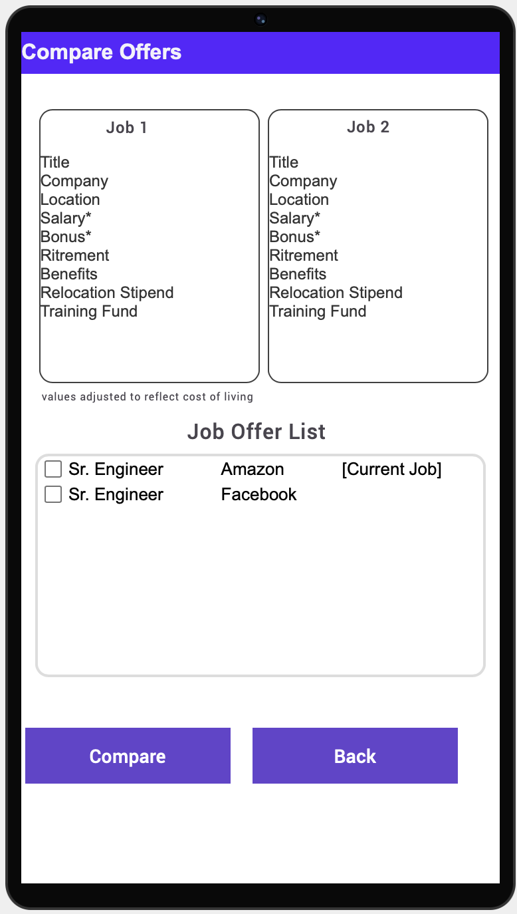

# Design Document

The following is an explanation and description of the Job Offer Comparison Application currently in progress by Team 075

**Author**: Team 075

## 1 Design Considerations

In the following subsections, various concerns will be addressed as they pertain to the system design.

### 1.1 Assumptions

- There will be a single user for this application, and therefore no user information/credentials will be maintained by the system.

- There will be a single system running this app and therefore does not need to handle any external communication.

- User's current job will not need to be deleted or removed, only updated.

- The user will have only one current job.

- Only two offers will need to be compared at any one time.

- There will be no limit to the number of job offers the system can maintain.

- The hardware running this application will have sufficient specifications (memory, storage, processing power, etc.) as to not cause an issue.

### 1.2 Constraints

- Because the application is running on an isolated environment with no external communication, persistent data will need to be stored locally on the device running the application, rather than on a remote server. This limits the amount of data able to be stored on the device. Fortunately in practice, the amount of data needed for the success of this application is minimal and should not present an issue. 

### 1.3 System Environment

- The application will be run only on devices compatible with API 30: Android 11.0 (R).

## 2 Architectural Design

The following outlines a high level view of the system architecture.

### 2.1 Component Diagram

- The component diagram below depicts the different components of the system and their interactions.
- The Main Menu is the entry point to the system and facilitates the user's navigation through the application.
- Through the Enter Current Job Details and Enter Offer Details components, information about each job and job offer will be entered by the user. That data will be collected and then inserted the Android SQLite database via the Offer Table Helper component.
- Similarly, when the user wishes to update the comparison settings through the Update Comparison Settings component, the information entered by the user is inserted into the database by the Comparison Settings Table Helper component.
- When information about job offers is needed the Main Menu, Enter Current Job Details, and View And Compare Offers components, the Offer Table Helper component extracts data from the database and delivers the data.
- Similarly, comparison settings data is needed in the Update Comparison Settings component, the Comparison Settings Table Helper component extracts and delivers the data. 
- When entering details about a new job offer in the Enter Offer Details component, the user will have the option to compare the offer immediately in the View and Compare Offers component.

### 2.2 Deployment Diagram

- The deployment environment is an isolated application on an Android 11.0 compatible device. Both the database and the application will be hosted on the same device.

## 3 Low-Level Design

The following details the class and database table structure used in this design.

### 3.1 Class Diagram

The class diagram for this system consist of three functional classes and two database tables. The following details each class, its role in the system, and its relation to other classes.

*NOTE: The accessor and modifier functions have been omitted for sake of readability*

- The _MainMenu_ class is the entry point to the system. This class is responsible for the navigation and control flow of the application. 
   - The _db_ attribute allows access to information regarding the current job offer data in the database. 
   - The _goToUpdateCurrentJob()_ method transfers control of the system to the _EnterCurrentJobDetails_ class.
   - The _goToAddJobOffer()_ method transfers control of the system to the _AddOfferDetails_ class.
   - The _goToAdjustComparisonSettings()_ method transfers control of the system to the _UpdateComparisonSettings_ class.
   - The _goViewAndCompareOffers()_ method transfers control of the system to the _ViewAndCompareOffers_ class.
- The _EnterCurrentJobDetails_ class facilitates data entry regarding the user's current job.
   - The _db_ attribute allows read, write, and update access to information regarding the user's current job.
   - The _save()_ method facilitates collecting the user entered data into an _Offer_ object, then passes that object to the _OfferTableHelper_ which will insert the data into the _OfferTable_ database table and returns control to the _MainMenu_ class.
   - The _cancel()_ method returns control to the _MainMenu_ class.
   - The _populateFields()_ method uses the _OfferTableHelper_ to extract data from the database and populate the corresponding fields in the GUI.
- The _EnterOfferDetails_ class facilitates data entry regarding new job offers.
   - The _db_ attribute allows write access to the _OfferTable_ database table.
   - The _saveOffer()_ method facilitates collecting the user entered data into an _Offer_ object, then passes that object to the _OfferTableHelper_ which will insert the data into the _OfferTable_ database table and returns control to the _MainMenu_ class.
   - The _saveAndCompare()_ method performs a similar function to the _save()_ method, but instead of returning control to the _MainMenu_ class, control is given to the _ViewAndCompareOffers_ class. The job id of the newly entered job offer is also passed.
   - The _addAnother()_ method also "saves" the job details in the same was as the _saveOffer()_ method, but control is passed to another instance of the _EnterOfferDetails_ class.
   - The _cancelOffer()_ method returns control to the _MainMenu_ class.
- The _ViewAndCompareOffers_ class facilitates viewing and comparing job offers.
   - The _offersDb_ and the _settingsDb_ attributes allow read access to the _OfferTable_ and the _ComparisonSettingsTable_, respectively.
   - The _compareJobs()_ method facilitates the collection of the selected job IDs for compare and displays the details about each job for the user to see.
   - The _populateJobDetails()_ method uses the _OfferTableHelper_ class to extract the data about each selected job, unpacks the data, and displays it for the user.
   - The _returnToMain()_ method returns control to the _MainMenu_ class.
   - The _buildJobsList()_ method facilitates the creation of a sorted job offers list to display to the user.
   - The _addOfferListing()_ method unpacks company and title from a given _Offer_ object and displays it on the screen, selecting it as a job to compare if indicated.
   - The _getSortedOffers()_ method uses the _OfferTableHelper_ to extract the data about all of the job offers in the system and the _ComparisonSettingsTableHelper_ to extract the comparison settings and sorts the job offers according to their score, which is determined using the comparison settings.
- The _UpdateComparisonSettings_ class facilitates the modification of the comparison settings.
   - The _db_ attribute allows read and update access to the _ComparisonSettingsTable_.
   - The _saveSettings()_ method facilitates the collection of comparison settings updated by the user into a _ComparisonSettings_ object and passes it to the _ComparisonSettingTableHelper_ object, which updates the _ComparisonSettingsTable_.
   - The _cancelSettings()_ method returns control to the _MainMenu_ class.
   - The _populateSettings()_ method uses the _ComparisonSettingTableHelper_ to extract data regarding the comparison settings form the _ComparisonSettingsTable_ and displays the information on the screen for the user. 
- The ComparisonSettings class is simply a container for comparison settings, for which there are corresponding attributes.
- The Offer class contains the data reflecting the offer details, boolean indicating whether the offer is the current job, and a unique job ID.
   - The _calculateScore()_ method calculates the offers score considering the given comparison settings. The _calculateScore()_ method uses the salary and bonus adjusted for cost of living, provided by the _getAdjustedSalary()_ and _getAdjustedBonus()_ methods.
- The _OfferTableHelper_ class contains attributes for the database name and table in which the job offer data is stored along with attributes corresponding the column and indices for that table.
   - The _insertOffer()_ method unpacks the given offer and inserts the data into the _OfferTable_ in the database.
   - The _getCurrentJob()_ method extracts the current job details and stores them in an _Offer_ object.
   - The _updateCurrentOffer()_ method updates the current job details with the information from the given _Offer_ object.
   - The _getNumberOfOffers()_ method returns the total number of offers currently in the _OfferTable_ in the database.
   - The _getOffers()_ extracts all the offers currently in the database and from that data creates and returns a list of _Offer_ objects reflecting that data.
   - The _getOffer()_ method extracts data regarding the job with the given job ID and from it, creates and returns an _Offer_ object.
- The _ComparisonSettingsTableHelper_ class contains attributes for the database name and table in which the comparison settings data is stored along with attributes corresponding the column and indices for that table.
   - The _getComparisonSettings()_ method extracts data regarding the current comparison settings from the _ComparisonSettingsTable_ database table, and from that data, creates and returns a _ComparisonSettings_ object.
   - The _updateComparisonSettings()_ method updates the current comparison settings in the _ComparisonSettingsTable_ table with the data contained in the given _ComparisonSettings_ object.
   - The _init()_ method is to be called immediately after the creation of the _ComparisonSettingsTable_ table and inserts a single row of zeros for every column.

### 3.2 Other Diagrams

No other diagrams are necessary.

## 4 User Interface Design

The below mockups/wireframes are conceptual designs that represent a two-dimensional depiction of a screen's interface by prioritizing the content on a high level. The mockups show how the user interacts with the application. It also connects information architecture to the visual aspects of the design by delivering pathways between the various pages. 

The flow depicted below is happy-path flow. The exception cases are not covered but will be covered in the application design (as part of D3). More importantly, the final design (as part D3) may look different based on the application's simplicity and usability.

### 4.1 Main Menu

### 4.2 New Current Job Form

### 4.3 Edit Current Job Form

### 4.4 New Job Offer Form

### 4.5 Edit Job Offer Form

### 4.6 Compare Jobs

### 4.7 Compare Jobs Results

