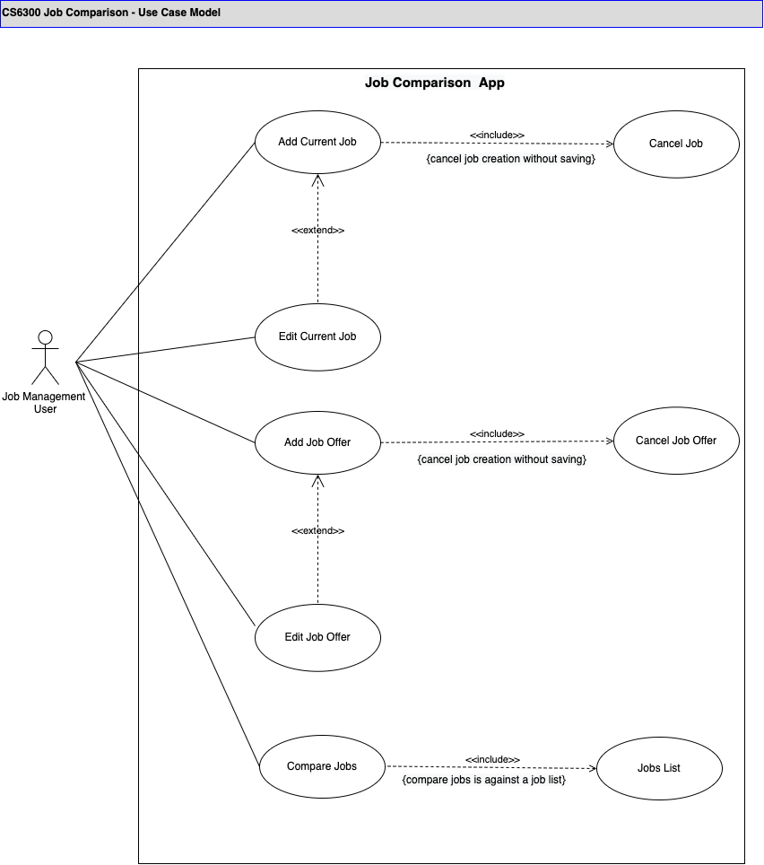

## Use Case Model

**Author**: Team 075

## 1 Use Case Diagram

[]

## 2 Use Case Descriptions
### **Use Case Number:** UC#01

**Use Case Name:** Add Current Job

**Use Case Description:** User should be able to add a current job..

**Primary Actor:** Job Management User

**Secondary Actor:** Job Comparison App

**Precondition:** User should be able to access the Job Comparison App

**Trigger:** User clicks on the Current Job on the Main Menu of the Job Comparison App

**Basic Flow:**

1. System displays a blank entry form (Add Current Job) to the User
2. User enters the fields
  1. Title
  2. Company
  3. Location (entered as city and state)
  4. Cost of living in the location
  5. Yearly salary
  6. Yearly bonus
  7. Retirement benefits (as percentage matched)
    1. 0 to 100% inclusive
  8. Relocation stipend
  9. Training and development fund
    1. $0 to $18000 inclusive annually
3. User clicks on the Add Current Job button
4. System displays successful add message
5. System provides an option to go back to Main Menu
6. User navigates back to Main Menu

**Alternate Flow / Business Rules**

1. System should allow the User should be able to cancel the current job form entry process at any given point in time. (UC#02)
  1. System will not save the data entered by the User.
2. System should not allow a User to have more than one current job
  1. If the current job is already created, then System will display the current job info when the User navigates from the Main menu > Current Job > Add Current Job screen
3. System should not allow the User to enter Retirement benefits entry less than 0% and greater than 100%
4. System should not allow the User to enter Training and development funds entry less than $0 and greater than $1800

**Notes:**

**Cost of living calculation:** To calculate each city's Price Index value, we start by assigning a value of 100 to a _central reference_ city (that happens to be Prague). Once the reference point has been established, the Price Index value of every other city in the database is calculated by comparing their cost of living to the cost of living in Prague.
Therefore, if a city has a Price Index of 134, that means that living there is 34% more expensive than living in Prague.

### **Use Case Number:** UC#02

**Use Case Name:** Cancel the Current Job data entry process

**Use Case Description:** User should be able to cancel the current job's data entry process without saving.

**Primary Actor:** Job Management User

**Secondary Actor:** Job Comparison App

**Precondition:** User should be able to access the Job Comparison App

**Trigger:** User clicks on the Current Job on the Main Menu of the Job Comparison App

**Basic Flow:**

1. System displays a blank entry form (Add Current Job) to the User
2. User enters the fields
  1. Title
  2. Company
  3. Location (entered as city and state)
  4. Cost of living in the location
  5. Yearly salary
  6. Yearly bonus
  7. Retirement benefits (as percentage matched)
    1. 0 to 100% inclusive
  8. Relocation stipend
  9. Training and development fund
    1. $0 to $18000 inclusive annually
3. User clicks on the Cancel button
4. System goes back to the Main Menu

**Alternate Flow / Business Rules**

1. System should allow the User should be able to complete the current job form entry process at any given point in time. (UC#01)

**Notes:**

**N/A**

### **Use Case Number:** UC#03

**Use Case Name:** Add Job Offer

**Use Case Description:** User should be able to add a job offer.

**Primary Actor:** Job Management User

**Secondary Actor:** Job Comparison App

**Precondition:** User should be able to access the Job Comparison App

**Trigger:** User clicks on the Job Offer on the Main Menu of the Job Comparison App

**Basic Flow:**

1. System displays a blank entry form (Add Job Offer) to the User
2. User enters the fields
  1. Title
  2. Company
  3. Location (entered as city and state)
  4. Cost of living in the location
  5. Yearly salary
  6. Yearly bonus
  7. Retirement benefits (as percentage matched)
    1. 0 to 100% inclusive
  8. Relocation stipend
  9. Training and development fund
    1. $0 to $18000 inclusive annually
3. User clicks on the Add Job Offer button
4. System displays successful add message
5. System provides an option to go back to Main Menu
6. User navigates back to Main Menu

**Alternate Flow / Business Rules**

1. System should allow the User should be able to cancel the job offer form entry process at any given point in time. (UC#02)
  1. System will not save the data entered by the User
2. System should allow the User to add more than one job offer
  1. If job offers exist in the system, then System will display all the job offers when the User navigates from Main menu > Job Offer Screen
3. System should not allow the User to enter Retirement benefits entry less than 0% and greater than 100%
4. System should not allow the User to enter Training and development fund entry less than $0 and greater than $1800

**Notes:**

**Cost of living calculation:** To calculate each city's Price Index value, we start by assigning a value of 100 to a _central reference_ city (that happens to be Prague). Once the reference point has been established, the Price Index value of every other city in the database is calculated by comparing their cost of living to the cost of living in Prague.
Therefore, if a city has a Price Index of 134, that means that living there is 34% more expensive than living in Prague.

### **Use Case Number:** UC#04

**Use Case Name:** Cancel Job Offer data entry process

**Use Case Description:** User should be able to cancel the job offer's data entry process without saving.

**Primary Actor:** Job Management User

**Secondary Actor:** Job Comparison App

**Precondition:** User should be able to access the Job Comparison App

**Trigger:** User clicks on the Current Job on the Main Menu of the Job Comparison App

**Basic Flow:**

1. System displays a blank entry form (Add Job Offer) to the User
2. User enters the fields
  1. Title
  2. Company
  3. Location (entered as city and state)
  4. Cost of living in the location
  5. Yearly salary
  6. Yearly bonus
  7. Retirement benefits (as percentage matched)
    1. 0 to 100% inclusive
  8. Relocation stipend
  9. Training and development fund
    1. $0 to $18000 inclusive annually
3. User clicks on the Cancel button
4. System goes back to the Main Menu

**Alternate Flow / Business Rules**

1. System should allow the User should be able to complete the job offer form entry process at any given point in time. (UC#03)

**Notes:**

**N/A**

### **Use Case Number:** UC#05

**Use Case Name:** Compare Job Offers

**Use Case Description:** User should have the ability to compare job offers

**Primary Actor:** Job Management User

**Secondary Actor:** Job Comparison App

**Precondition:** User should be able to access the Job Comparison App

**Trigger:** User clicks on the Current Job on the Main Menu of the Job Comparison App

**Basic Flow:**

1. System displays current job, and a list of job offers to the User
  1. System displays Display current job and selected job offer(s) by Title and Company
2. User enters values (integers) in comparison settings.
  1. Yearly salary
  2. Yearly bonus
  3. Retirement benefits
  4. Relocation stipend
3. User selects to do make comparison between two job offers
4. User clicks on the Compare Jobs button
5. System will display the following information for the selected two jobs
  1. Title
  2. Company
  3. Location (entered as city and state)
  4. Yearly salary adjusted for cost of living
  5. Yearly bonus adjusted for cost of living
  6. Retirement benefits
  7. Relocation stipend
  8. Training and development fund
6. System provides an option to go back to Main Menu
7. User navigates back to Main Menu

**Alternate Flow / Business Rules**

1. System should allow the User should be able to cancel the job comparison process at any given point of time. (UC#06)
2. System will disable the **Compare Jobs** action if no job offers are listed.
3. System should allow the User to compare more than two job offers
4. System should allow the User to enter Yearly salary adjusted for cost of living as an integer > 0
5. System should allow the User to enter a Yearly bonus adjusted for Cost of living as an integer > 0
6. System should allow the User to enter Retirement benefits entry as an integer > 0
7. System should allow the User to enter the Relocation stipend as an integer > 0
8. System should allow the User to enter the Training and development fund as an integer > 0
9. System will default null values If no weights are assigned to any of the fields - Yearly salary, Yearly bonus, Retirement benefits, Relocation stipend, and Training and development fund
10. The formula to determine the ranking sort is as follows: AYS + AYB + (RBP \* AYS / 100) + RS + TDF
 where:
 AYS = yearly salary adjusted for cost of living
 AYB = yearly bonus adjusted for cost of living
 RBP = retirement benefits percentage

RS = relocation stipend
 TDF = training and development fund

_For example, if the weights are 2 for the yearly salary, 2 for relocation stipend, and 1 for all other factors, the score would be computed as:2/7 \* AYS + 1/7 \* AYB + 1/7 \* (RBP \* AYS / 100) + 2/7 \* RS + 1/7 \* TDF_

### **Use Case Number:** UC#06

**Use Case Name:** Cancel Job Comparison data entry process

**Use Case Description:** User should be able to cancel the job offer's data entry process without saving.

**Primary Actor:** Job Management User

**Secondary Actor:** Job Comparison App

**Precondition:** User should be able to access the Job Comparison App

**Trigger:** User clicks on the Current Job on the Main Menu of the Job Comparison App

**Basic Flow:**

1. System displays current job, and a list of job offers to the User
  1. System displays Display current job and selected job offer(s) by Title and Company
2. User enters values (integers) in comparison settings.
  1. Yearly salary
  2. Yearly bonus
  3. Retirement benefits
  4. Relocation stipend
3. System provides an option to go back to Main Menu
4. User clicks on the Cancel button
5. System goes back to the Main Menu

**Alternate Flow / Business Rules**

1. System should allow the User should be able to complete the compare job process at any given point of time. (UC#05)
